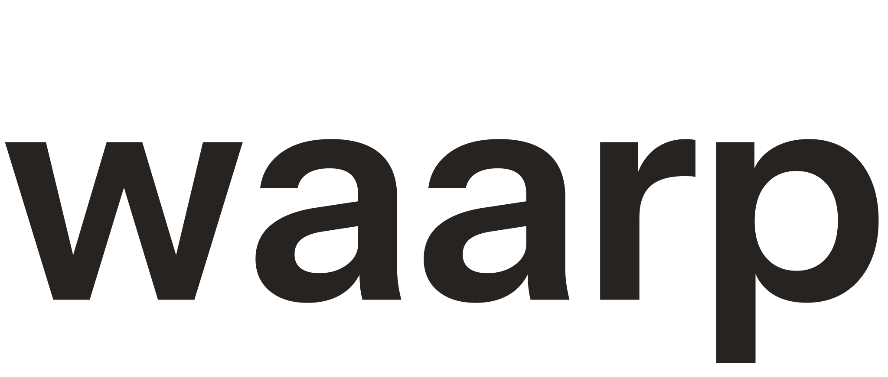
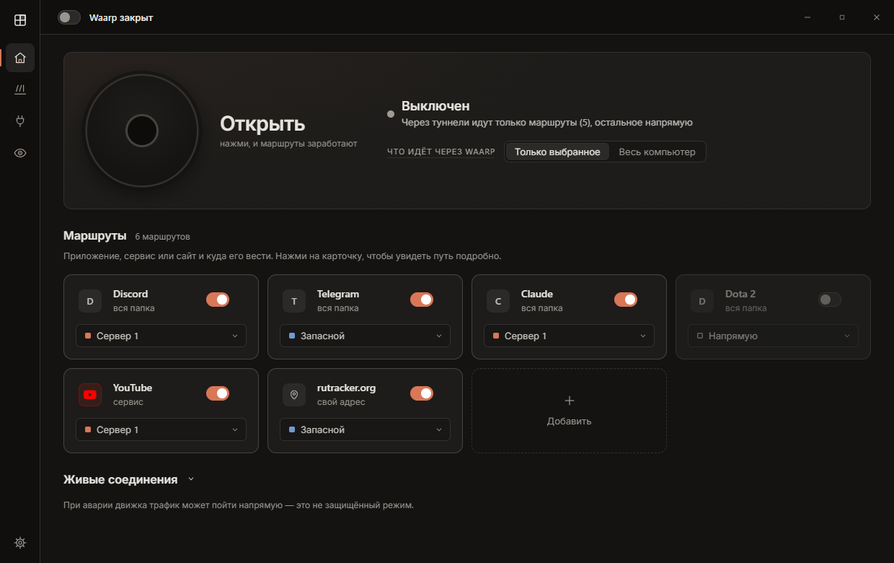
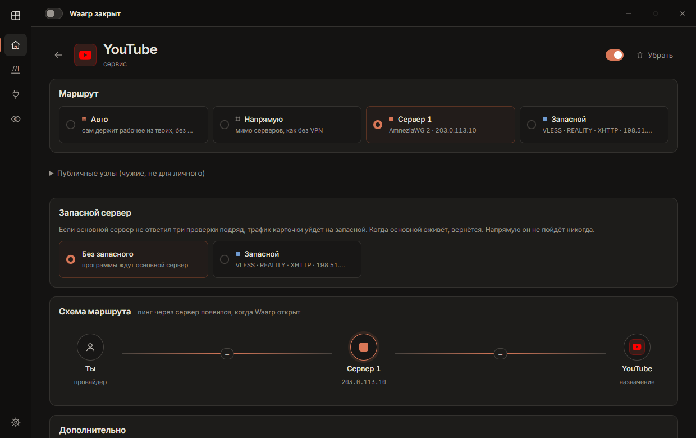
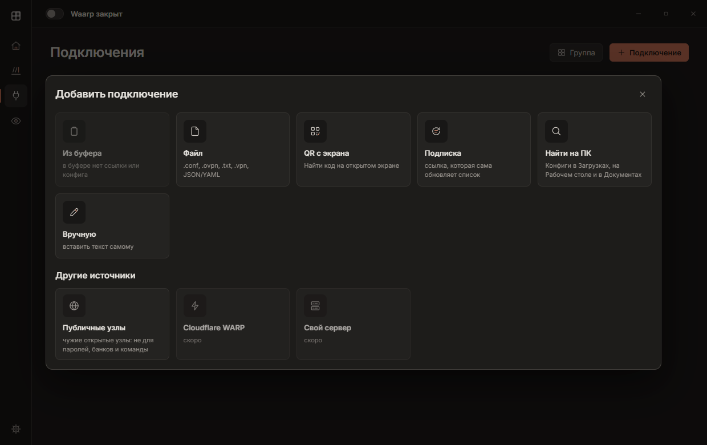
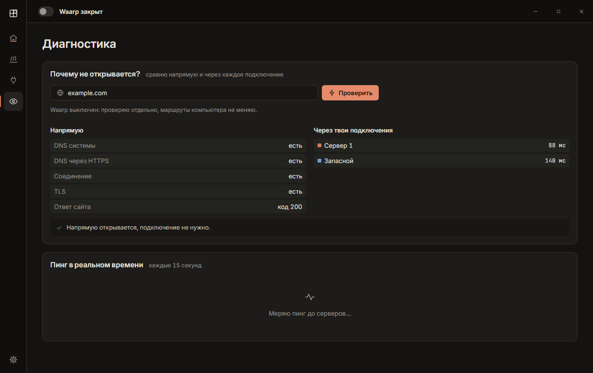

<p align="center">
  <picture>
    <source media="(prefers-color-scheme: dark)" srcset="docs/brand/waarp-wordmark-light.svg">
    <source media="(prefers-color-scheme: light)" srcset="docs/brand/waarp-wordmark-dark.svg">
    
  </picture>
</p>

<p align="center">
  <strong>Открытый маршрутизатор трафика для Windows: приложения, сайты, нестабильные сети.</strong><br>
  Маршрутизация в духе ExitLag, только бесплатно, прозрачно и через ваши собственные VPN и прокси.
</p>

<p align="center">
  <a href="README.md">English</a> · <a href="README.ru.md">Русский</a>
</p>

<p align="center">
  <a href="#скачать">Скачать</a> · <a href="#скриншоты">Скриншоты</a> · <a href="#как-это-работает">Как это работает</a> · <a href="#безопасность">Безопасность</a> · <a href="ROADMAP.md">Roadmap</a> · <a href="#участие">Участие</a>
</p>

> **Бесплатно и с открытым кодом. Подписка на Waarp не нужна.**
> Подключения (VPN, VPS, прокси) ваши; у сторонней инфраструктуры может быть своя цена.

<p align="center">
  
</p>
<p align="center"><em>Пускайте по другому пути только то, что нужно. Остальной Windows не трогается.</em></p>

| Точная маршрутизация | Стабильность | Видно, что сломалось |
| --- | --- | --- |
| Приложения и сайты идут разными путями. | Авто держит рабочий маршрут, а не гонится за каждым пингом. | DNS, TCP, TLS и HTTP напрямую и через ваши подключения рядом. |

## Скачать

**[Скачать последнюю версию для Windows →](../../releases/latest)**

Windows 10 / 11, x64. Интерфейс пока на русском.

**Нашли баг?** Заводите issue. **Знаете, как исправить?** Присылайте pull request — небольшие точечные фиксы особенно приветствуются.

## Как это работает

Waarp не загоняет весь компьютер в один VPN. У каждой цели своё намерение:

- **Напрямую** — обычная сеть;
- **конкретное подключение** — ваш VPN или прокси, либо их группа;
- **Авто** — выбирает из ваших подходящих подключений и держится за рабочее.

Цели: приложения, сервисы или свои адреса. Режим «весь компьютер» ведёт всё остальное через выбранный путь, а явные правила продолжают работать.

### Авто

Авто предсказуемо и не переоптимизирует маршрут каждые несколько секунд:

- участвуют только ваши непубличные подключения;
- текущий путь «липкий», один пропущенный пинг его не переключает;
- переключение только при подтверждённом отказе или заметно лучшем кандидате;
- проверки ограничены, а движок держит не больше **16** подключений Авто одновременно, поэтому библиотека из сотен профилей не держит сотни туннелей в памяти (остальные остаются в библиотеке, их можно выбрать вручную и проверить в диагностике);
- Авто никогда не уходит в «Напрямую» или на публичный узел. Если подходящего пути нет, маршрут остаётся недоступным, а не утекает.

### Диагностика

Waarp отвечает на практичные вопросы: работает ли цель напрямую? Через одно из моих подключений? Где отказ: DNS, TCP, TLS или HTTP? И не делает лишних выводов: «напрямую не работает, через подключение работает» — это факт, а не автоматически «блокировка провайдера». Когда туннель закрыт, отдельная локальная проверка смотрит ограниченный набор ваших подключений, без TUN и без изменения маршрутов системы.

### Поддерживаемые подключения

Движок: [sing-box-lx](https://github.com/Leadaxe/sing-box-lx) (в комплекте, с лицензией, в `engine/`).

- AmneziaWG / WireGuard
- VLESS, VMess, Trojan, Shadowsocks
- Hysteria2, TUIC v5
- OpenVPN (скрипты, плагины и внешние файлы ключей отклоняются)
- подписки и поддерживаемые JSON / YAML

Импорт из файла, буфера обмена, QR-кода, ссылки подписки, поиска на компьютере или вручную. Публичный каталог подключений — отдельный источник с низким доверием; публичные узлы никогда не попадают в Авто сами. Эти узлы держат третьи лица, не Waarp; их владельцы могут записывать незашифрованный трафик. Источники: [docs/SOURCES.md](docs/SOURCES.md).

## Скриншоты

<p align="center">
  
  
</p>
<p align="center">
  
</p>

## Осторожное поведение при сбоях Windows

Waarp старается не оставлять после себя изменений в сети и не запускается, если состояние неясно:

- перед каждым запуском он только читает состояние сети: если остался адаптер Waarp или занята его служебная подсеть, он не запускается и ничего не меняет;
- остановка сначала мягкая, затем принудительная только для своего процесса, затем проверка;
- он никогда не удаляет сетевые адаптеры, не сбрасывает Winsock и DNS и не трогает другой VPN;
- после сна перезапускается не больше одного раза и только когда сеть вернулась.

Ограничения: эти правила покрыты офлайн-тестами; реальные сон, выключение, оставшийся адаптер и другой VPN ещё не проверены на тестовой машине. Полная таблица отказов и что ещё не доказано: [docs/RELIABILITY.md](docs/RELIABILITY.md).

## Безопасность

- Песочница Electron, изоляция контекста, без Node в интерфейсе.
- Ключи VPN хранятся через Windows DPAPI, без запасного хранения открытым текстом.
- Движок и его DLL сверяются с ожидаемыми хешами перед каждым запуском.
- Импортированные конфиги проверяются до того, как попадут в движок.
- Удалённые и отозванные маршруты остаются заблокированными, а не становятся «Напрямую».
- Небольшой локальный мост позволяет другим приложениям на этом компьютере попросить маршрут для своей цели по токену на один запуск; конфиги и ключи он не отдаёт. См. [docs/BRIDGE.md](docs/BRIDGE.md).

Waarp — инструмент маршрутизации, а не гарантия анонимности: владелец подключения всё равно видит трафик, который через него идёт.

**Нет независимого kill switch.** Waarp не держит отдельную блокировку через WFP или брандмауэр. Если движок упадёт, Windows может пустить трафик обычным путём. Не считайте Waarp защитой от утечек.

Об уязвимостях сообщайте по [SECURITY.md](SECURITY.md), а не в публичном issue.

## Сборка из исходников

Windows 10/11, Node.js. Права администратора нужны только при запуске туннеля.

```bash
npm install
npm run dev
```

Проверки (все офлайн):

```bash
npm run typecheck
npm test
npm run check
npm run build
```

`npm run test:live` меняет сеть: запускайте его только на отдельной тестовой машине.

## Участие

См. [CONTRIBUTING.md](CONTRIBUTING.md).

Репорты о багах, странных маршрутах и проблемах Windows полезны даже без готового фикса. Перед публикацией логов и скриншотов удалите ключи, ссылки подписок, токены, приватные адреса серверов и другие секреты.

## Благодарности

- [sing-box-lx](https://github.com/Leadaxe/sing-box-lx) на основе [sing-box](https://github.com/SagerNet/sing-box) — сетевой движок, поставляется отдельным исполняемым файлом; лицензия: [`engine/LICENSE`](engine/LICENSE), происхождение: [`engine/SOURCE.md`](engine/SOURCE.md)
- [Electron](https://www.electronjs.org/), [React](https://react.dev/), [Vite](https://vitejs.dev/)
- [Instrument Sans](https://github.com/Instrument/instrument-sans), [Inter](https://rsms.me/inter/), [JetBrains Mono](https://www.jetbrains.com/lp/mono/) — SIL Open Font License
- [Simple Icons](https://simpleicons.org/) — CC0

Полный список: [THIRD_PARTY_NOTICES.md](THIRD_PARTY_NOTICES.md).

ExitLag — товарный знак своего владельца. Waarp — независимый проект и не связан с ExitLag.

## Лицензия

Собственный код Waarp распространяется по [Apache License 2.0](LICENSE), см. также [NOTICE](NOTICE).
Сторонние компоненты сохраняют свои лицензии: движок sing-box-lx поставляется отдельной программой под собственной лицензией (текст GPL-3.0-or-later плюс условие upstream об использовании названия и упоминании связи, см. [`engine/LICENSE`](engine/LICENSE)), см. [THIRD_PARTY_NOTICES.md](THIRD_PARTY_NOTICES.md). Бинарники движка не хранятся в Git: `npm run engine:fetch` скачивает и проверяет закреплённый релиз, `npm run dist` без них не собирает.
